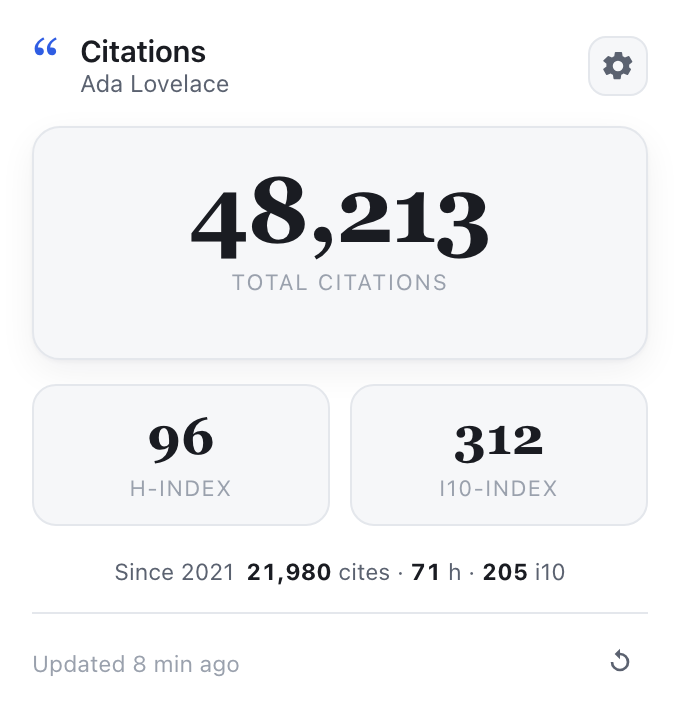
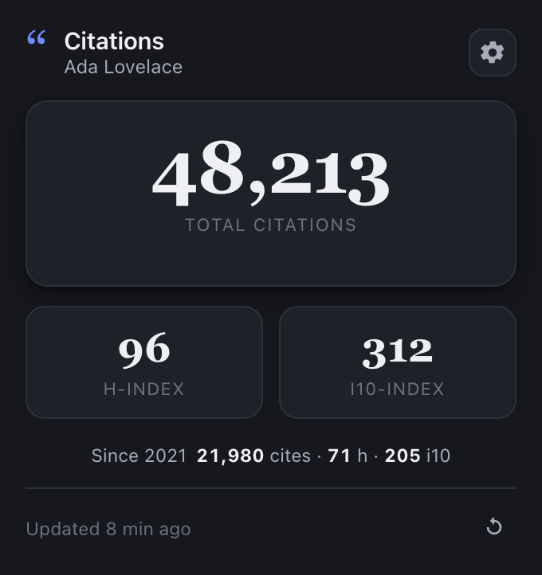

<div align="center">

# Show Your Citations

**把你的 Google Scholar 引用数、h 指数、i10 指数放到浏览器工具栏一键可见——而且在中国大陆免梯子可用。**

[English](README.md) · 中文

[](https://github.com/JingxuanKang/Show-Your-Citations/releases)
[](manifest.json)
[](server/)
[](LICENSE)
[](CONTRIBUTING.md)

<table>
  <tr>
    <td></td>
    <td></td>
  </tr>
</table>

</div>

## 亮点

- 📊 **总引用数、h 指数、i10 指数**一目了然，附 *Since &lt;年份&gt;* 分列数据。
- 🔢 工具栏图标**徽章**实时显示引用数。
- 🔔 引用数 / h 指数上升时**桌面通知**。
- 🔄 每 6 小时**自动刷新**，打开弹窗即显示缓存数字。
- 🌍 **大陆可用**——代理前挂 Cloudflare 即可，免梯子。
- 🎨 跟随系统的**明暗双主题**。
- 🔒 **端到端归你**——代理你自己跑，不向任何第三方发送数据。

## 工作原理

扩展从不直接访问 Google Scholar，而是调用**你自己跑的代理服务**，由它抓取并解析主页、
返回干净 JSON；这个服务前面可选挂 Cloudflare 做边缘缓存 + 国内可达。

```
 扩展 ──HTTPS──▶ Cloudflare（可选）──▶ 代理服务 ──▶ scholar.google.com
 弹窗/SW         边缘缓存 · 国内可达    你的 VPS(server/)   服务端解析
     ▲                                     │
     └──────────────── JSON ◀───────────────┘   { 引用数, h-index, i10-index, … }
```

> **为什么用服务而不是纯 Cloudflare Worker？** Google Scholar 对 Cloudflare Worker 的
> 共享边缘 IP 直接回 `HTTP 403`，Worker 抓不到。所以抓取必须跑在普通（未被封）的服务器
> IP 上，Cloudflare 只能挡在**前面**做缓存和可达。详见 [Deploy.md](Deploy.md)。

## 快速开始

### 1. 跑起代理（一次性）

任意「IP 不被 Scholar 封」的常驻主机即可（多数 VPS 都行）。用 Docker：

```bash
cd server
docker build -t scholar-proxy .
docker run -d --restart unless-stopped -p 8080:8080 --name scholar-proxy scholar-proxy
```

裸 Node 部署、挂 Cloudflare 走国内、缓存等完整说明见 **[Deploy.md](Deploy.md)**。

### 2. 加载扩展

从 [Releases](https://github.com/JingxuanKang/Show-Your-Citations/releases) 下载
`show-your-citations-v*.zip` 或克隆本仓库 → `chrome://extensions/` 开启**开发者模式** →
**加载已解压的扩展程序**，选中该文件夹（或把 zip 拖进页面）。

### 3. 配置

点图标 → **打开设置**：

| 字段 | 填什么 |
| --- | --- |
| **Google Scholar 主页 URL** | 你的主页地址，user id 自动提取 |
| **代理端点** | 第 1 步服务的基地址（如 `https://scholar.example.com`） |

点**测试连接**→**保存**。搞定，引用数会出现在徽章上。

## 配置参考

所有设置都在选项页里，经 `chrome.storage.sync` 同步：

| 设置项 | 默认值 | 说明 |
| --- | --- | --- |
| Scholar 主页 / id | — | 追踪哪个 profile |
| 代理端点 | *(空)* | 你的代理服务基地址，必填 |
| 桌面通知 | 开 | 引用数 / h 指数上升时通知 |
| 自动刷新 | 开 | 后台每 6 小时刷新一次 |

发布的扩展**刻意不带默认端点**：每个人跑自己的代理，任何一台服务器都不必承担所有人的流量。

## 常见问题

**真的能在大陆用吗？** 能——只要代理服务器在墙外、并用 Cloudflare 代理域名前置。
Cloudflare 边缘大陆可达，真正的抓取发生在你墙外的服务器上。

**数字和我的 Google Scholar 页面一致吗？** 一致——代理读的就是你主页上那张统计表
（引用数 / h 指数 / i10 指数，含 *All* 与 *Since &lt;年份&gt;*）。

**我的数据会去哪？** 只到你自己的代理。服务端不落盘、无统计、无账号、无第三方端点，
只抓你配置的那个公开 Scholar id。

**会被 Google Scholar 风控吗？** 个人用不会——你的服务器只抓你自己 profile、缓存 1 小时，
Scholar 一天最多看到几次请求。（别把很多用户指向同一台共享服务器，那种「集中」才会触发风控。）

**是 Google 官方产品吗？** 不是。个人自用的非官方工具，与 Google 无隶属或背书关系。

## 开发

纯 ES module，无构建步骤。克隆后当「已解压扩展」加载即可；本地调试代理
`cd server && node server.js`；打发布包 `./package.sh`。Scholar 改版时最常要动的解析逻辑在
[`server/server.js`](server/server.js)。

## 项目结构

```
Show-Your-Citations/
├── manifest.json          # MV3 配置
├── popup.html · popup.js  # 工具栏 UI
├── options.html · .js     # 设置页
├── background.js          # service worker：定时、徽章、通知
├── styles.css · options.css
├── lib/api.js             # 共享配置 + 抓取 + 解析（ES module）
├── server/                # 可移植代理：server.js + Dockerfile
├── tools/                 # 图标生成器
├── icons/ · docs/
├── Deploy.md              # 代理部署与自托管
├── CONTRIBUTING.md
└── package.sh             # 打发布 zip
```

## 贡献

欢迎 issue / PR，见 [CONTRIBUTING.md](CONTRIBUTING.md)。

## 许可证

[MIT](LICENSE) © Jingxuan Kang

---

<div align="center">
<sub>与 Google Scholar 无关联。为爱看数字上涨的科研人而做。觉得有用就点个 ⭐。</sub>
</div>
